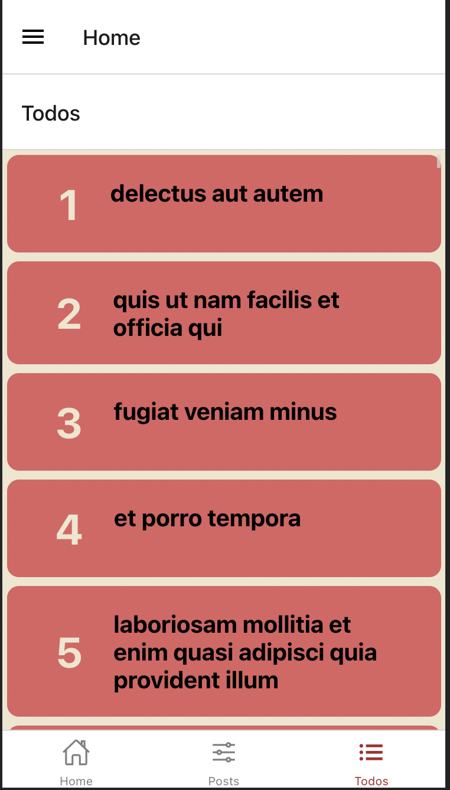

# React Native App

## Installation

Firstly clone this project

`git clone https://github.com/171-Logo-Siber-FullStack-Bootcamp/week3-assignment-mbthngndz.git`

## Usage

After clone, go to myProject folder via "cd myProject"
Install npm and require npm packeges 
run expo start 
press w

## Screens

